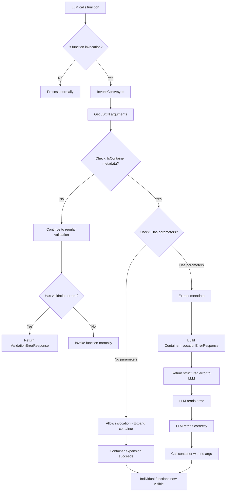
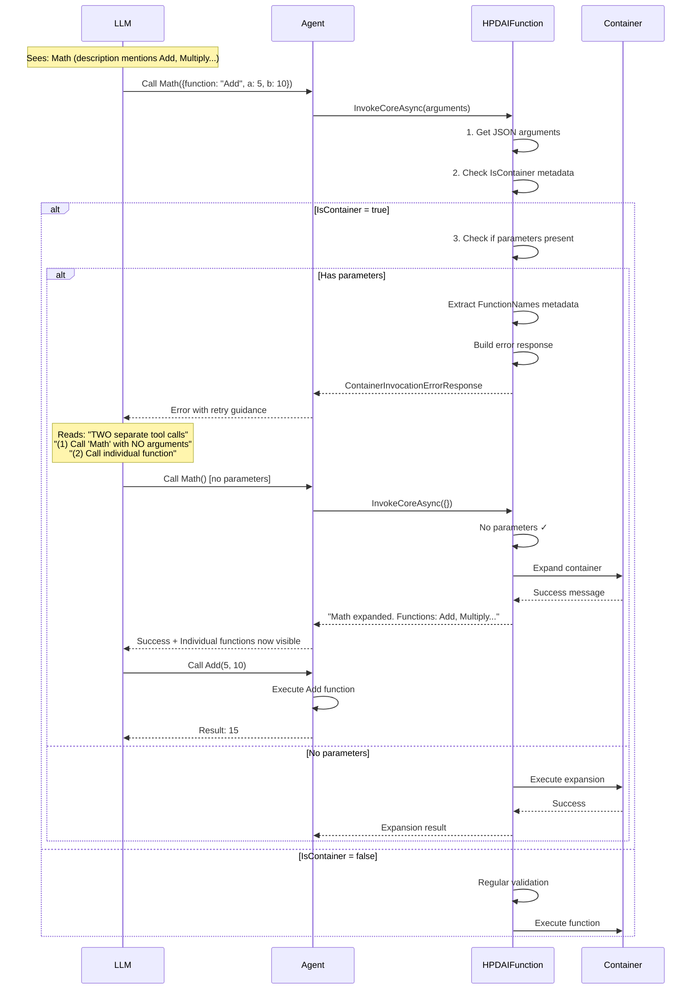
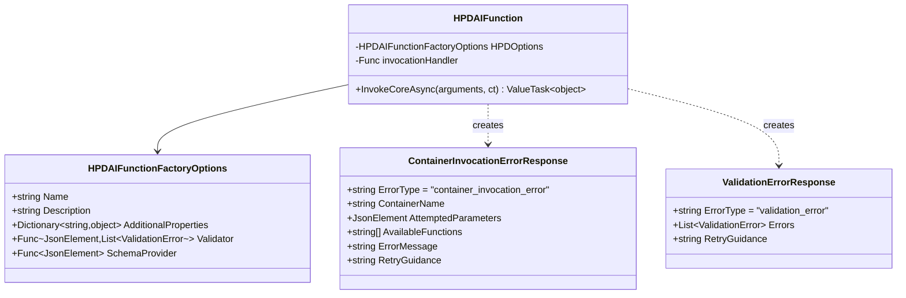
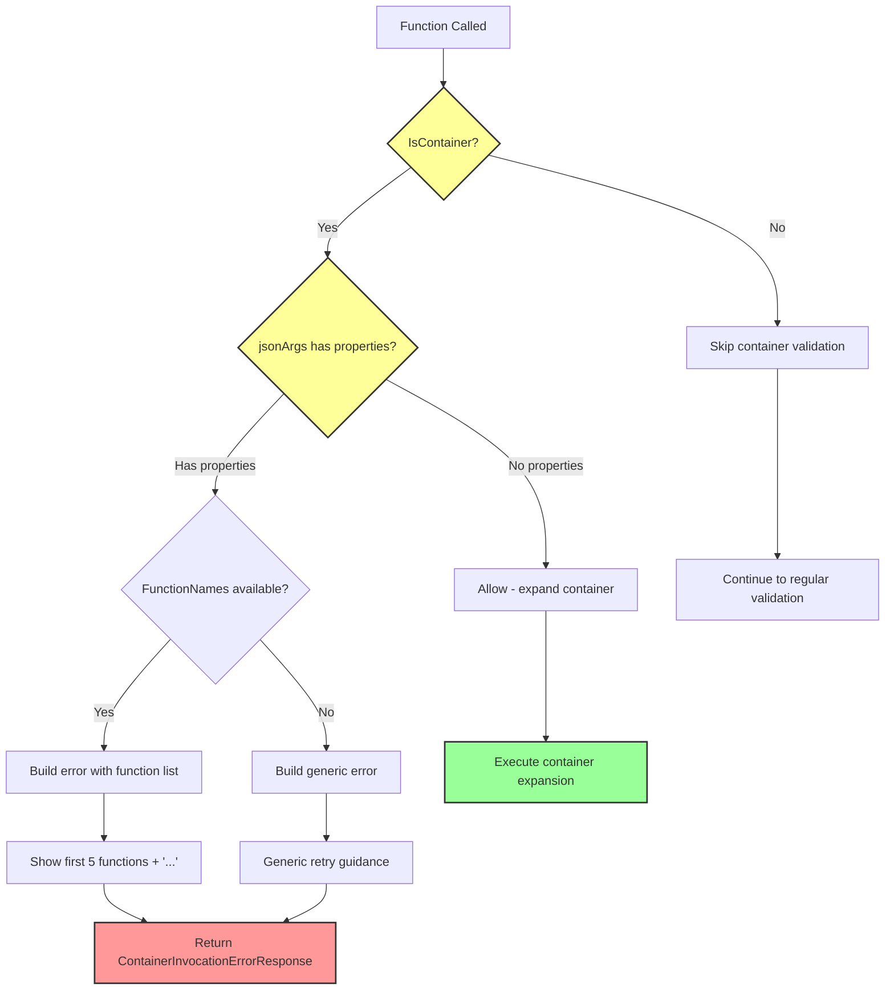
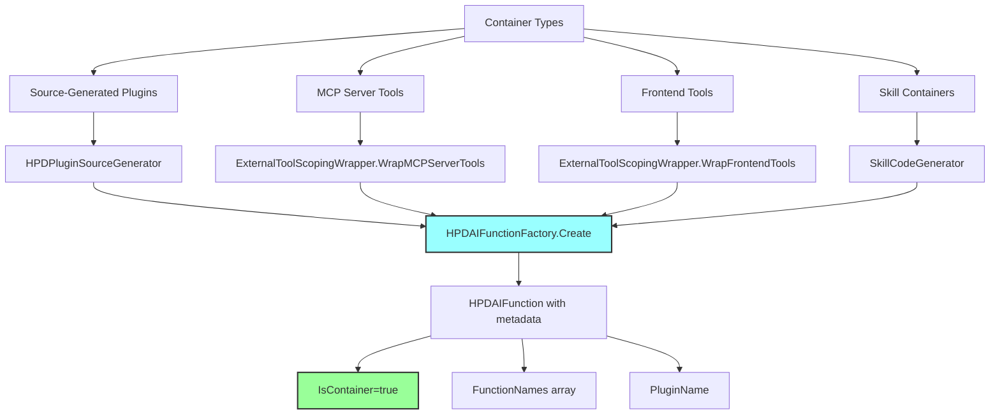
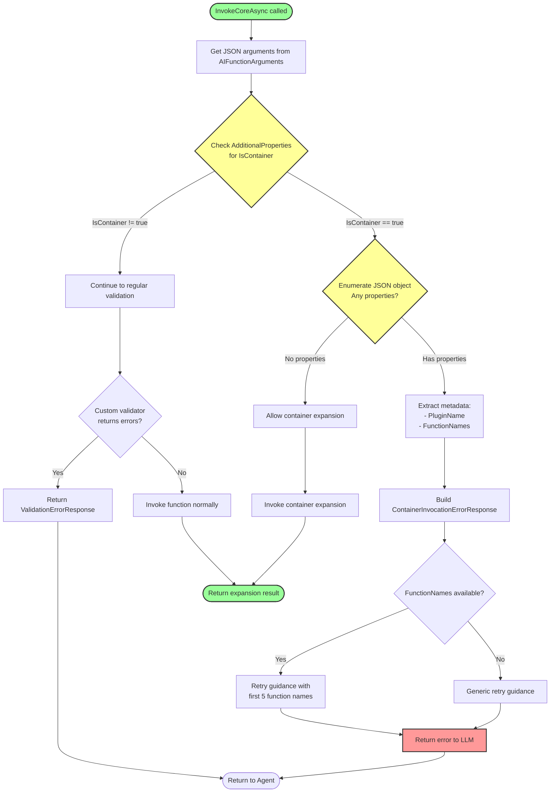
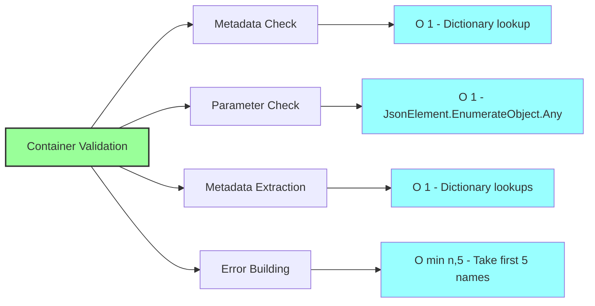
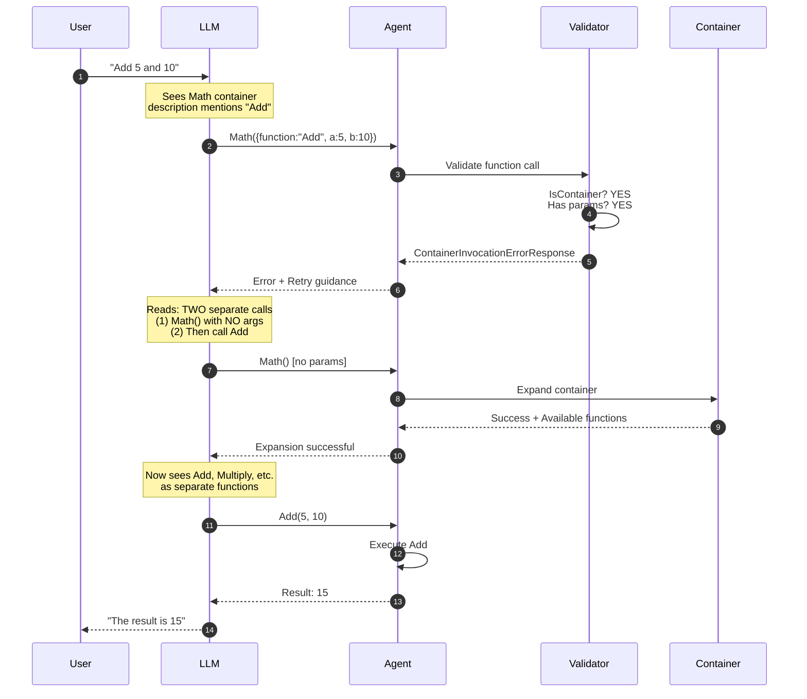

# Container Parameter Validation Architecture

## Overview

This document describes the container-specific parameter validation mechanism that prevents LLMs from incorrectly invoking plugin containers with parameters. Plugin containers must be called with no arguments to expand, then individual functions can be called.

## Problem Statement

When plugin collapsing is enabled, the LLM sees container function descriptions that mention individual function names (e.g., "Math plugin with Add, Multiply, Divide..."). The LLM may incorrectly try to invoke the container with parameters like:

```json
{
  "name": "Math",
  "arguments": {
    "function": "Add",
    "a": 5,
    "b": 10
  }
}
```

This is incorrect because containers must be expanded first with no arguments.

## Solution Architecture



## Validation Flow Detail



## Component Architecture



## Metadata Structure

```mermaid
graph LR
    A[Container Function] --> B[AdditionalProperties]

    B --> C[IsContainer: true]
    B --> D[PluginName: 'Math']
    B --> E[FunctionNames: string[]]
    B --> F[FunctionCount: int]
    B --> G[SourceType: MCP/Frontend/Plugin]

    E --> H[Add]
    E --> I[Multiply]
    E --> J[Divide]
    E --> K[...]

    style A fill:#f9f,stroke:#333,stroke-width:2px
    style C fill:#9f9,stroke:#333,stroke-width:2px
```

## Validation Decision Tree



## Error Response Examples

### Container with Parameters Error

```json
{
  "error_type": "container_invocation_error",
  "container_name": "Math",
  "attempted_parameters": {
    "function": "Add",
    "a": 5,
    "b": 10
  },
  "available_functions": ["Add", "Multiply", "Abs", "Square", "Subtract", "Min", "SolveQuadratic"],
  "error_message": "'Math' is a container function that groups related functions. It cannot be called with parameters.",
  "retry_guidance": "This requires TWO separate tool calls: (1) First call 'Math' with NO arguments to expand it. (2) After expansion succeeds, call the individual function you need. Available functions: Add, Multiply, Abs, Square, Subtract, ..."
}
```

### Regular Validation Error (for comparison)

```json
{
  "error_type": "validation_error",
  "errors": [
    {
      "property": "file_path",
      "attempted_value": null,
      "error_message": "file_path is required",
      "error_code": "REQUIRED_FIELD"
    }
  ],
  "retry_guidance": "The provided arguments are invalid. Please review the errors, correct the arguments based on the function schema, and try again."
}
```

## Integration Points



## Code Locations

| Component | File | Lines |
|-----------|------|-------|
| Container Validation Logic | `HPD-Agent/Plugins/HPD-AIFunctionFactory.cs` | 85-120 |
| Error Response Class | `HPD-Agent/Plugins/HPD-AIFunctionFactory.cs` | 188-211 |
| JSON Serialization | `HPD-Agent/AOT/HPDContext.cs` | 19 |
| Test Suite | `test/HPD-Agent.Tests/Validation/ContainerValidationTests.cs` | Full file |
| MCP Container Creation | `HPD-Agent/Plugins/ExternalToolScopingWrapper.cs` | 48-95 |
| Frontend Container Creation | `HPD-Agent/Plugins/ExternalToolScopingWrapper.cs` | 98-178 |

## Validation Algorithm



## Testing Coverage

```mermaid
graph TD
    A[Test Suite: 12 Tests] --> B[Container Detection]
    A --> C[Different Container Types]
    A --> D[Error Message Guidance]
    A --> E[Regular Functions]

    B --> B1[Container with parameters → error]
    B --> B2[Container without parameters → success]
    B --> B3[Empty JSON object handling]
    B --> B4[Nested parameters detection]

    C --> C1[Source-generated plugin containers]
    C --> C2[MCP server containers]
    C --> C3[Frontend tools containers]
    C --> C4[Skill containers]

    D --> D1[First 5 function names shown]
    D --> D2[Generic guidance when no names]
    D --> D3[Attempted parameters captured]

    E --> E1[Regular functions work normally]
    E --> E2[Functions without metadata unaffected]

    style A fill:#9ff,stroke:#333,stroke-width:3px
```



## Performance Characteristics



## LLM Interaction Flow



## Future Enhancements

1. **Dot Notation Detection**: Detect patterns like `Math.Add` and provide specific guidance
2. **Smart Function Matching**: Fuzzy matching to suggest correct function names
3. **Container Auto-Expansion**: Option to auto-expand on first invalid attempt
4. **Telemetry**: Track how often validation catches errors for analytics

## Related Documentation

- [Plugin Collapsing Implementation Notes](plugin-scoping-implementation-notes.md)
- [Plugin User Guide](plugins/USER_GUIDE.md)
- [Middleware Architecture](middleware/README.md)
- [Error Handling](ERROR_HANDLING_MIDDLEWARE.md)
